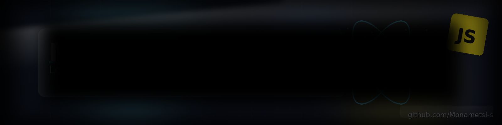

<!-- Banner -->

  

<h1 align="center">Hi there, I'm Monametsi 👋</h1>

  <em>Aspiring Software Engineer • Always Learning • Future Innovator</em>

  
  
  

<!-- Typing SVG -->

  

## 🚀 About Me
- 🌱 Currently growing my technical and leadership skills
- 🎯 Goal: Make impactful contributions to my team and organization
- 🤝 Open to collaborating on challenging projects

## 🛠️ Tech Stack

## 📊 GitHub Analytics

  
  

  

<!-- Activity Graph -->

  

## 📫 Connect
- LinkedIn: [monametsi-seele](https://www.linkedin.com/in/monametsi-seele/)
- Email: seelemonametsi@gmail.com

---
*“Learning never stops – every challenge is an opportunity to grow.”*
